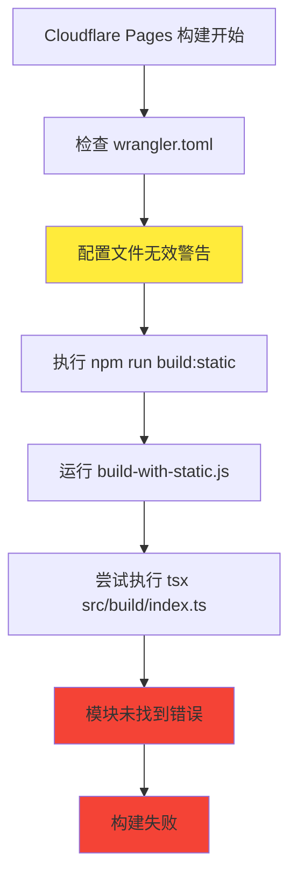
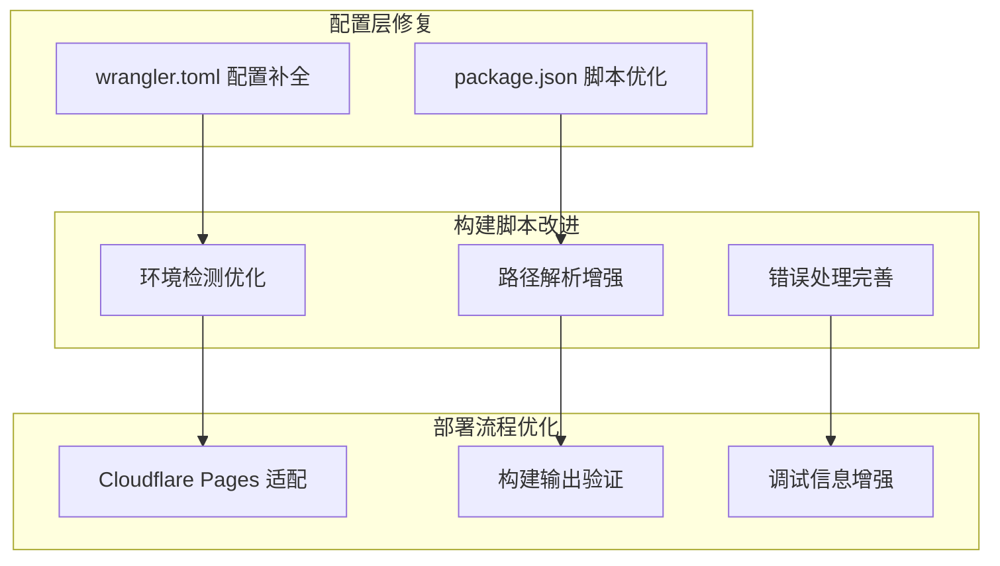
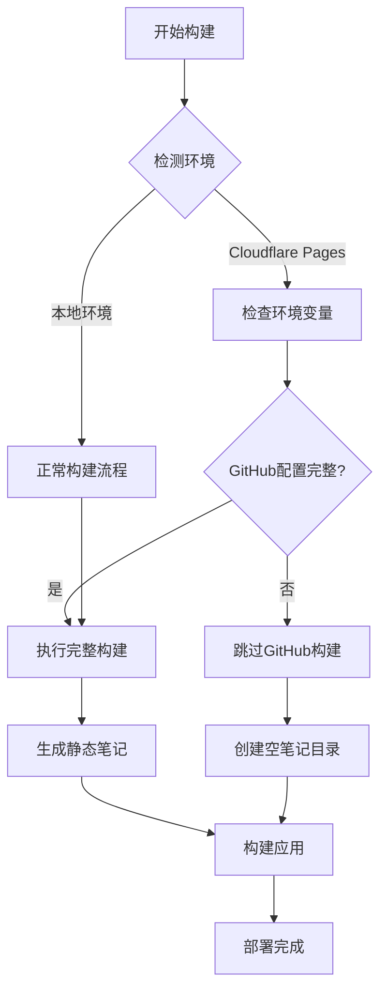
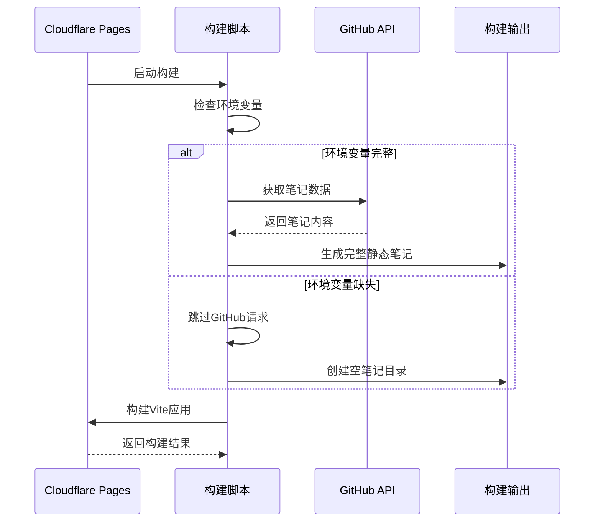
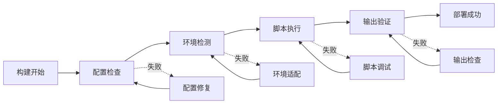
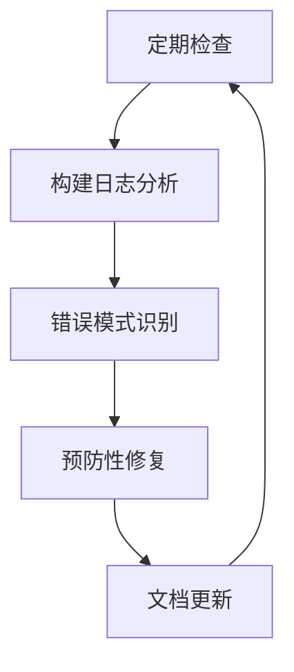

# Cloudflare Pages 部署构建问题修复设计

## Overview

SparkLog在Cloudflare Pages部署时出现构建失败，错误信息显示无法找到`/opt/buildhome/repo/src/build/index.ts`模块。本设计将通过分析错误日志、识别根本原因并提供完整的修复方案来解决此问题。

### 问题描述

- **部署平台**: Cloudflare Pages
- **错误类型**: `Error [ERR_MODULE_NOT_FOUND]`
- **失败位置**: 构建脚本中的 `tsx src/build/index.ts` 执行
- **当前状态**: 本地构建成功，Cloudflare Pages部署失败

## 根本原因分析

### 错误定位

通过分析构建日志，发现以下关键问题：



### 主要问题识别

1. **wrangler.toml配置不完整**
   - 缺少必需的`pages_build_output_dir`属性
   - Cloudflare Pages无法识别有效的构建配置

2. **构建脚本路径解析问题**
   - `tsx`工具在Cloudflare Pages环境中执行路径解析异常
   - 相对路径在容器环境中可能失效

3. **环境兼容性问题**
   - 本地与Cloudflare Pages环境差异导致模块解析不一致

## Architecture Design

### 修复策略架构



### 解决方案组件

| 组件 | 功能 | 修复内容 |
|------|------|----------|
| wrangler.toml | 部署配置 | 添加pages_build_output_dir配置 |
| build-with-static.js | 构建脚本 | 增强环境检测和错误处理 |
| package.json | 脚本定义 | 优化构建命令配置 |
| 环境变量处理 | 配置管理 | 改进缺失变量的处理逻辑 |

## 修复实施方案

### 1. wrangler.toml 配置修复

**问题**: 缺少Cloudflare Pages必需的构建输出目录配置

**解决方案**: 添加必要的配置属性

```toml
name = "sparklog"
compatibility_date = "2025-08-01"
pages_build_output_dir = "dist"
```

### 2. 构建脚本环境适配

**问题**: 构建脚本未能适配Cloudflare Pages环境特性

**解决方案**: 增强环境检测和容错机制



### 3. 路径解析优化

**问题**: `tsx`命令在容器环境中路径解析失败

**解决方案**: 使用绝对路径和node直接执行

#### 原有实现问题
```javascript
// 原有的问题实现
execSync('tsx src/build/index.ts', { stdio: 'inherit' })
```

#### 优化后的实现
```javascript
// 改进的实现，使用绝对路径
const buildScriptPath = path.resolve(process.cwd(), 'src/build/index.ts')
execSync(`npx tsx "${buildScriptPath}"`, { stdio: 'inherit' })
```

### 4. 环境变量处理改进

**目标**: 提供优雅的降级处理，确保在环境变量缺失时仍能完成构建



## 实施步骤

### 第一阶段：配置文件修复
1. 修复`wrangler.toml`配置
2. 验证Cloudflare Pages能够识别配置

### 第二阶段：构建脚本优化
1. 增强环境检测逻辑
2. 改进路径解析机制
3. 完善错误处理和日志

### 第三阶段：部署测试验证
1. 执行Cloudflare Pages部署测试
2. 验证各种环境变量配置场景
3. 确认构建输出正确性

## 测试验证方案

### 测试场景矩阵

| 场景 | 环境变量状态 | 预期结果 |
|------|-------------|----------|
| 完整配置 | 所有GitHub变量已设置 | 完整静态笔记生成 |
| 部分配置 | 缺少部分GitHub变量 | 优雅降级，空笔记目录 |
| 无配置 | 无GitHub相关变量 | 应用正常构建，提示信息 |

### 验证检查点



## 风险评估

### 潜在风险

1. **配置变更影响**: wrangler.toml修改可能影响现有部署
2. **构建时间延长**: 增强的错误处理可能延长构建时间
3. **向后兼容性**: 脚本修改可能影响本地开发环境

### 风险缓解措施

1. **渐进式部署**: 先在测试环境验证修复效果
2. **回滚机制**: 保留原有配置的备份
3. **兼容性测试**: 确保本地和远程环境都能正常工作

## 监控和维护

### 部署监控指标

- 构建成功率
- 构建时间
- 错误类型分布
- 环境变量配置覆盖率

### 维护策略



### 故障处理流程

1. **问题识别**: 通过构建日志快速定位问题类型
2. **环境诊断**: 检查环境变量和配置文件状态
3. **修复实施**: 根据问题类型选择对应的修复方案
4. **验证测试**: 确认修复效果并防止回归