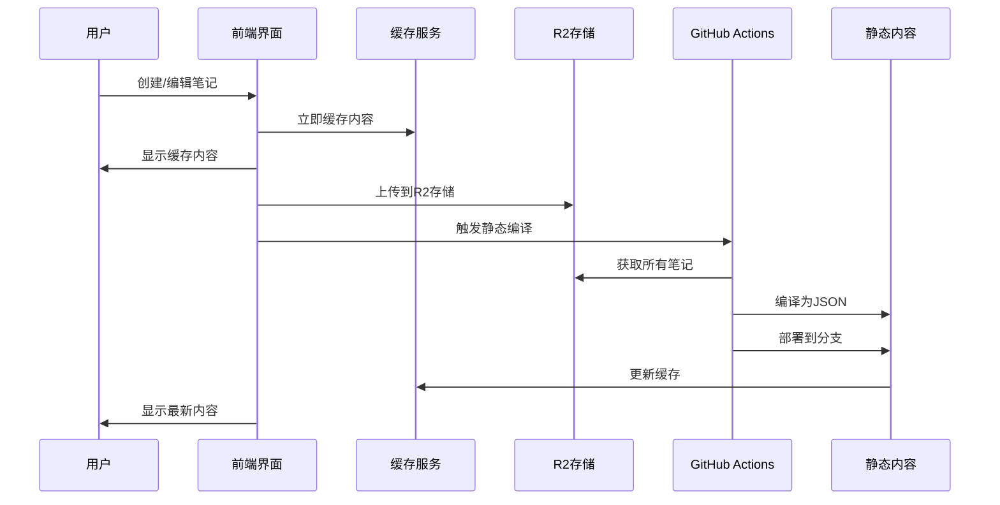
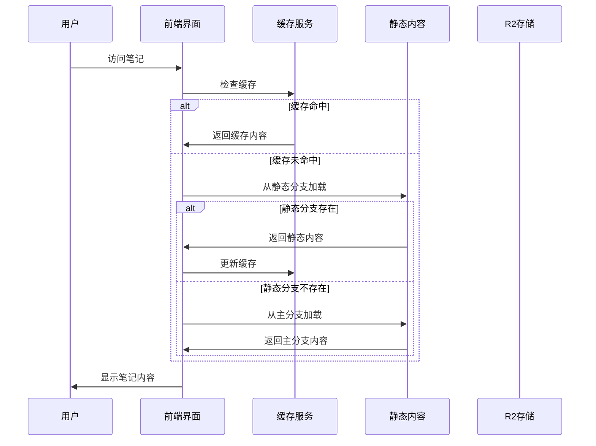

# SparkLog 架构设计

## 🏗️ 整体架构

SparkLog 采用了创新的 **R2 + 静态编译 + 智能缓存** 三层架构，实现了高性能、高可用性和强安全性的完美平衡。

```
┌─────────────────────────────────────────────────────────────┐
│                    用户界面层 (Frontend)                      │
│  ┌─────────────┐ ┌─────────────┐ ┌─────────────────────┐  │
│  │   React     │ │   Vite      │ │   Tailwind CSS      │  │
│  │ Components  │ │   Build     │ │   Dark/Light Theme  │  │
│  └─────────────┘ └─────────────┘ └─────────────────────┘  │
└─────────────────────────────────────────────────────────────┘
                              │
                              ▼
┌─────────────────────────────────────────────────────────────┐
│                    应用逻辑层 (Application Logic)             │
│  ┌─────────────┐ ┌─────────────┐ ┌─────────────────────┐  │
│  │   Hooks     │ │   Services  │ │   Utils & Types     │  │
│  │ useR2Notes  │ │ R2Storage   │ │   Note Utils        │  │
│  │ useGitHub   │ │ Encryption  │ │   Cache Service     │  │
│  └─────────────┘ └─────────────┘ └─────────────────────┘  │
└─────────────────────────────────────────────────────────────┘
                              │
                              ▼
┌─────────────────────────────────────────────────────────────┐
│                    数据存储层 (Data Storage)                  │
│  ┌─────────────┐ ┌─────────────┐ ┌─────────────────────┐  │
│  │ Cloudflare  │ │   GitHub    │ │   Local Cache       │  │
│  │     R2      │ │   Actions   │ │   Memory Cache      │  │
│  │  (源文件)    │ │ (静态编译)   │ │   (实时数据)        │  │
│  └─────────────┘ └─────────────┘ └─────────────────────┘  │
└─────────────────────────────────────────────────────────────┘
```

## 🔄 数据流程

### 1. 笔记创建/编辑流程



### 2. 内容访问流程



## 🏛️ 核心组件

### 1. 前端组件 (Frontend Components)

- **`App.tsx`**: 主应用入口，路由管理
- **`NotesPage.tsx`**: 笔记列表页面，集成 R2 功能
- **`NoteEditPage.tsx`**: 笔记编辑页面，支持加密/解密
- **`BuildStatusIndicator.tsx`**: 构建状态显示组件

### 2. 业务逻辑 (Business Logic)

- **`useR2Notes`**: 核心 Hook，统一管理笔记操作
- **`useGitHub`**: GitHub 相关操作 Hook
- **`useTheme`**: 主题管理 Hook

### 3. 服务层 (Services)

#### R2 存储服务 (`R2StorageService`)
```typescript
class R2StorageService {
  // 上传笔记到 R2
  async uploadNote(key: string, content: string): Promise<boolean>
  
  // 从 R2 下载笔记
  async downloadNote(key: string): Promise<string | null>
  
  // 删除 R2 中的笔记
  async deleteNote(key: string): Promise<boolean>
  
  // 列出所有笔记
  async listNotes(): Promise<string[]>
}
```

#### 加密服务 (`EncryptionService`)
```typescript
class EncryptionService {
  // 加密私密笔记
  async encrypt(content: string, password: string): Promise<string>
  
  // 解密私密笔记
  async decrypt(encryptedContent: string, password: string): Promise<string>
  
  // 检测内容是否已加密
  isEncrypted(content: string): boolean
}
```

#### 缓存服务 (`NoteCacheService`)
```typescript
class NoteCacheService {
  // 缓存笔记
  cacheNote(note: Note): void
  
  // 获取缓存的笔记
  getCachedNote(key: string): Note | null
  
  // 清除缓存
  clearCache(): void
  
  // 获取缓存统计
  getCacheStats(): CacheStats
}
```

#### 笔记操作服务 (`NoteOperationsService`)
```typescript
class NoteOperationsService {
  // 创建笔记
  async createNote(noteData: NoteData, adminPassword?: string): Promise<OperationResult>
  
  // 更新笔记
  async updateNote(originalNote: Note, noteData: NoteData, adminPassword?: string): Promise<OperationResult>
  
  // 删除笔记
  async deleteNote(note: Note): Promise<OperationResult>
  
  // 触发静态构建
  async triggerStaticBuild(): Promise<void>
}
```

### 4. 配置管理 (`config/`)

- **`env.ts`**: 环境变量配置，包括 R2 和静态内容分支配置
- **`defaultRepo.ts`**: 默认仓库配置

### 5. 类型定义 (`types/`)

- **`Note.ts`**: 笔记数据结构定义
- **其他接口定义**: 支持新架构的各种数据类型

## 🔐 安全架构

### 1. 数据加密

- **加密算法**: AES-GCM 256位
- **密钥派生**: 基于管理员密码的 PBKDF2 派生
- **加密范围**: 仅私密笔记内容，元数据保持明文

### 2. 访问控制

- **公开笔记**: 无需认证，任何人可访问
- **私密笔记**: 需要管理员密码解密
- **权限验证**: 前端实时验证，后端无状态

### 3. 数据隔离

- **源文件**: 存储在私有 R2 存储桶
- **静态内容**: 部署到公开 GitHub 分支
- **加密内容**: 编译时保持加密状态

## 🚀 性能优化

### 1. 多层缓存

- **内存缓存**: 编辑后立即显示
- **静态缓存**: 预编译的 JSON 文件
- **浏览器缓存**: HTTP 缓存头优化

### 2. 异步处理

- **非阻塞操作**: 编辑后立即返回
- **后台编译**: GitHub Actions 异步处理
- **增量更新**: 只重新编译变更内容

### 3. 智能加载

- **懒加载**: 按需加载笔记内容
- **预加载**: 预加载常用数据
- **降级策略**: 静态内容失败时回退到主分支

## 🔧 部署架构

### 1. 前端部署

- **构建工具**: Vite + React
- **部署平台**: Cloudflare Pages / Vercel
- **静态资源**: CDN 全球分发

### 2. 后端服务

- **存储服务**: Cloudflare R2 (S3 兼容)
- **编译服务**: GitHub Actions
- **版本控制**: Git 分支管理

### 3. 监控和日志

- **构建状态**: 实时显示编译进度
- **错误处理**: 优雅降级和错误提示
- **性能监控**: 缓存命中率和加载时间

## 📊 架构优势

### 1. **高性能**
- 静态内容毫秒级加载
- 多层缓存减少延迟
- CDN 全球分发

### 2. **高可用性**
- R2 存储高可用性
- 多分支部署策略
- 优雅降级机制

### 3. **强安全性**
- 端到端加密
- 数据物理隔离
- 无后端依赖

### 4. **易维护性**
- 模块化设计
- 清晰的职责分离
- 完善的测试覆盖

### 5. **成本效益**
- 无服务器成本
- 按使用量付费
- 自动扩缩容

## 🔮 未来扩展

### 1. **功能扩展**
- 多用户支持
- 协作编辑
- 版本历史

### 2. **技术升级**
- WebAssembly 支持
- Service Worker 缓存
- 实时同步

### 3. **平台扩展**
- 移动应用
- 桌面应用
- API 服务

这个架构设计确保了 SparkLog 能够以最小的资源消耗提供最大的性能和安全性，同时保持了代码的可维护性和扩展性。 